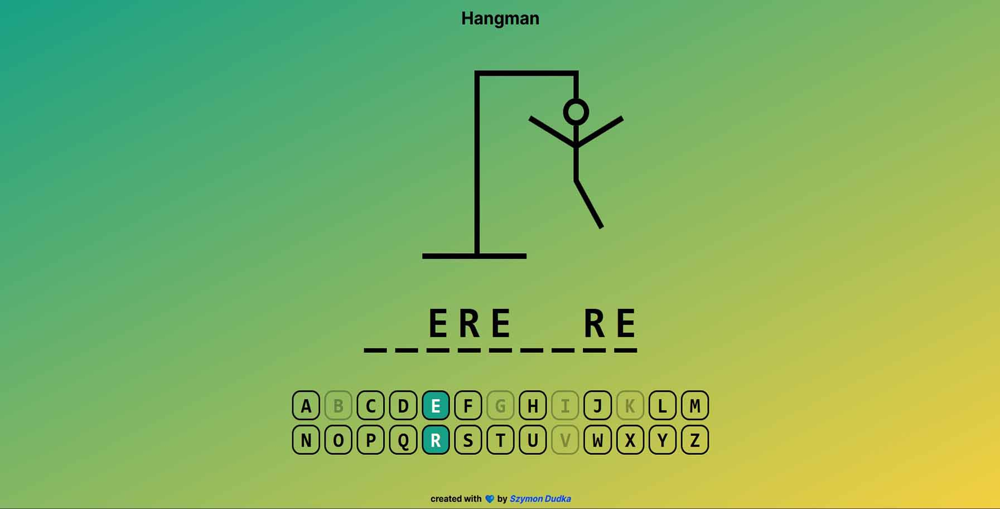

# Hangman



The game where you have to guess all the letters of a word. Created with React and TypeScript.

https://hangman-sd.vercel.app

## Main technologies


## Stack

- [Vite](https://vitejs.dev) - a new breed of frontend build tooling that significantly improves the frontend development experience

## Details

- created with React and TypeScript
- styling with styled-components
- responsive on mobile devices

## Tutorial and project structure

Inside the project you'll see the following folders and files:

```
PROJECT_ROOT        # index files
├── public          # public files
└── src             # files and components
```

Download the repository to your local machine and run to download all missing dependencies:

```
npm install
```

After that you can run this project with:

```
npm run dev
```

To build your application use:

```
npm run build
```
